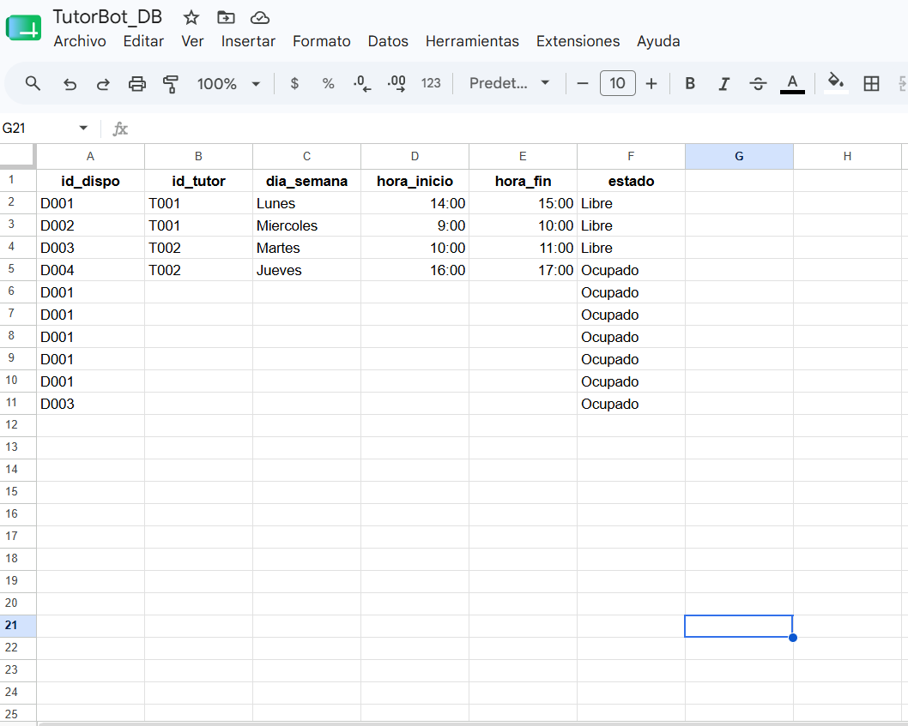
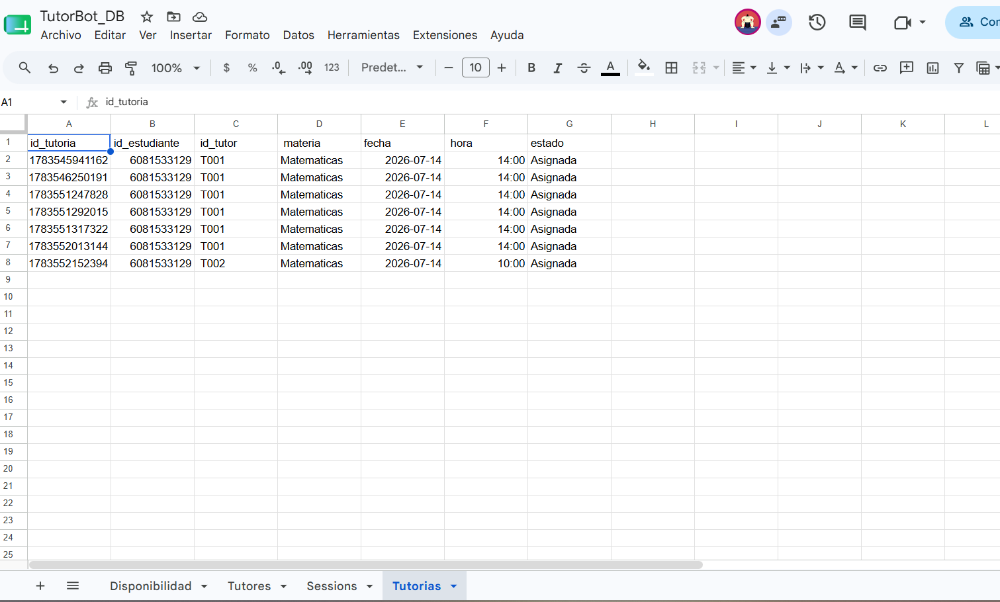
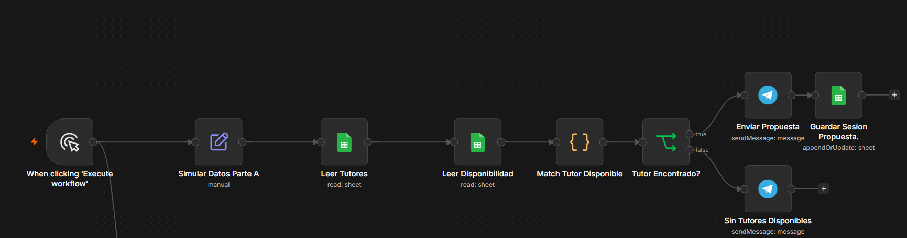
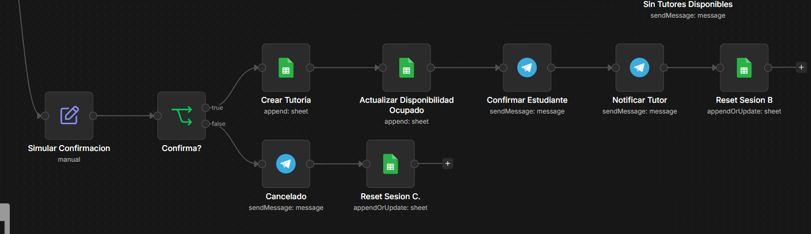
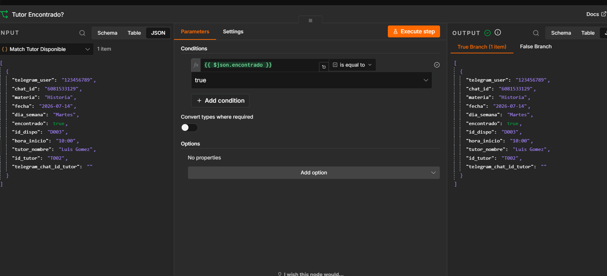

# TutorBot — Sistema de Asesorías Académicas

Bot de Telegram construido en n8n que conecta estudiantes con tutores disponibles, gestionando materias, horarios, confirmaciones y registro de tutorías en Google Sheets.

## Introducción

En el entorno educativo actual, la coordinación de asesorías académicas suele ser un proceso caótico y manual. Los estudiantes dependen de correos electrónicos o mensajes informales para encontrar un tutor, mientras que los tutores no tienen una agenda centralizada para gestionar su disponibilidad. Esto genera cruces de horarios, desatención de materias críticas y falta de trazabilidad.

**TutorBot** es una solución automatizada desarrollada en n8n que conecta a estudiantes con tutores mediante un motor de asignación inteligente, gestionando el proceso desde la solicitud inicial hasta la finalización de la asesoría.

## Objetivos

- Desarrollar un sistema automatizado para la gestión de tutorías académicas que integre Telegram, Google Sheets y lógica avanzada de asignación.
- Implementar un motor de búsqueda que asocie automáticamente materia, tutor y horario libre.
- Diseñar una interfaz conversacional en Telegram para la autogestión del estudiante (solicitar, consultar, cancelar).
- Automatizar el control de estados de la tutoría (Solicitada, Asignada, Confirmada, Finalizada).
- Generar reportes automáticos de actividad para la coordinación académica.
- Validar disponibilidad en tiempo real para evitar cruces de agenda o doble reserva.

## Resultado esperado

1. **Reducción del 90%** en el tiempo de asignación de tutorías.
2. **Trazabilidad total**: historial completo de quién solicitó, quién atendió y cuándo terminó.
3. **Escalabilidad**: capacidad para gestionar cientos de tutores y estudiantes simultáneamente.
4. **Experiencia de usuario**: interfaz amigable que guía al estudiante paso a paso sin necesidad de manuales.

## Integrantes

- **Julian Pinto Uribe** — Entrada y captura de datos (menú, sesión, selección de materia y fecha)
- **Heiling Leon** — Motor de asignación y confirmación (matching, registro, notificaciones)

## Arquitectura general

El bot funciona como una máquina de estados: cada usuario tiene una fila en la hoja `SESSIONS` que indica en qué paso de la conversación está (`paso_actual`). Un nodo `Switch` (Router Paso) dirige el mensaje entrante al bloque de lógica correspondiente según ese paso.

```
Telegram Trigger → Leer Sesión → Router Paso
                                    ├── menu                    → [Parte A]
                                    ├── esperando_materia        → [Parte A]
                                    ├── esperando_fecha          → [Parte A → Parte B]
                                    └── esperando_confirmacion   → [Parte A → Parte B]
```


*Captura del workflow final ya integrado, Parte A + Parte B (agregar cuando esté unido).*

## Base de datos (Google Sheets)

Archivo compartido: `TutorBot_DB` — mismo `documentId` usado en todos los nodos de Sheets del proyecto.

| Hoja | Responsable | Descripción |
|---|---|---|
| `TUTORES` | Julian Pinto Uribe | Catálogo de tutores, materias que dan, estado |
| `SESSIONS` | Julian Pinto Uribe | Estado de la conversación por usuario |
| `DISPONIBILIDAD` | Heiling Leon | Horarios de cada tutor y si están libres/ocupados |
| `TUTORIAS` | Heiling Leon | Registro de tutorías asignadas |

---

## Parte A (Julian Pinto Uribe) — Entrada y captura de datos

*(Pendiente de documentar por Julian Pinto Uribe: configuración del bot en Telegram, estructura de `TUTORES` y `SESSIONS`, flujo del menú de materias, selección de materia, y validación de fecha.)*

### Hojas de Sheets

*(Julian Pinto Uribe: pega aquí la estructura final de `TUTORES` y `SESSIONS` con columnas y ejemplo de datos)*


### Nodos del flujo

*(Julian Pinto Uribe: lista de nodos, qué hace cada uno, y capturas de pantalla)*


*Captura del tramo de nodos de Parte A en n8n (Telegram Trigger → Router Paso → menú → materia → fecha).*


*Configuración del nodo Switch que dirige según `paso_actual`.*

### Cómo probar esta parte

*(Julian Pinto Uribe: instrucciones paso a paso para correr y verificar el menú, la selección de materia, y la validación de fecha)*


---

## Parte B (Heiling Leon) — Motor de asignación y confirmación

Responsable de todo lo que ocurre después de que el estudiante entrega una **materia** y una **fecha válida**: buscar un tutor disponible, proponerlo, confirmar la tutoría y dejar todo registrado.

### Hojas de Sheets

**`DISPONIBILIDAD`**

| Columna | Descripción |
|---|---|
| `id_dispo` | Identificador único del horario |
| `id_tutor` | Referencia al tutor (coincide con `TUTORES.id_tutor`) |
| `dia_semana` | `Lunes`, `Martes`, `Miercoles`, `Jueves`, `Viernes`, `Sabado`, `Domingo` (sin tilde) |
| `hora_inicio` / `hora_fin` | Formato `HH:MM`, 24 horas |
| `estado` | `Libre` u `Ocupado` |

**`TUTORIAS`**

| Columna | Descripción |
|---|---|
| `id_tutoria` | Identificador único (generado con `Date.now()`) |
| `id_estudiante` | `telegram_user` del estudiante |
| `id_tutor` | Tutor asignado |
| `materia` / `fecha` / `hora` | Datos de la tutoría confirmada |
| `estado` | Ver ciclo de estados abajo |

### Ciclo de estados de una tutoría

| Estado | ¿Quién lo genera? | Descripción |
|---|---|---|
| `Solicitada` | Parte A | Se crea cuando el estudiante pide una tutoría (antes de encontrar tutor) |
| `Asignada` | Parte B | Se marca cuando el sistema encuentra tutor y horario libre, y el estudiante confirma |
| `Confirmada` |  Parte A | *(Pendiente definir: puede ser el mismo momento que "Asignada", o un paso extra donde el tutor confirma manualmente — a coordinar con Julian Pinto Uribe)* |
| `Finalizada` | Parte A | Se marca cuando la tutoría ya se llevó a cabo (posiblemente vía el flujo de "consultar estado" o un recordatorio posterior) |
| `Cancelada` | Parte B | Se marca cuando el estudiante rechaza la propuesta de tutor/horario |

> Nota: `TUTORES` necesita una columna adicional `telegram_chat_id` (chat_id real de cada tutor en Telegram), usada para notificarle cuando se le asigna una tutoría.




### Flujo de nodos (Bloque 1 — Matching)

1. **`Leer Tutores`** — Google Sheets, Get Row(s), trae toda la hoja `TUTORES`.
2. **`Leer Disponibilidad`** — Google Sheets, Get Row(s), trae toda la hoja `DISPONIBILIDAD`.
3. **`Match Tutor Disponible`** — Code (JavaScript). Filtra tutores activos que dan la materia solicitada, cruza contra disponibilidad libre en el día correspondiente, y devuelve el mejor match (o `encontrado: false` si no hay).
4. **`Tutor Encontrado?`** — IF, evalúa `encontrado === true`.
   - **True** → `Enviar Propuesta` (Telegram) → `Guardar Sesion Propuesta` (actualiza `SESSIONS` a `esperando_confirmacion`, guardando los datos del tutor propuesto en `datos_parciales`).
   - **False** → `Sin Tutores Disponibles` (Telegram).



### Flujo de nodos (Bloque 2 — Confirmación)

1. **`Interpretar Confirmacion`** — recibe la respuesta del estudiante (sí/no) junto con los datos guardados en `datos_parciales`.
2. **`Confirma?`** — IF, evalúa la respuesta.
   - **True** → `Crear Tutoria` (append en `TUTORIAS`, estado `Asignada`) → `Actualizar Disponibilidad Ocupado` (marca el `id_dispo` usado como `Ocupado`) → `Confirmar Estudiante` (Telegram) → `Notificar Tutor` (Telegram, usando `telegram_chat_id` del tutor) → `Reset Sesion B` (vuelve `SESSIONS` a `menu`).
   - **False** → `Cancelado` (Telegram) → `Reset Sesion C` (vuelve `SESSIONS` a `menu`).



### Lógica clave — código de matching

```javascript
const sesion = $('Simular Datos Parte A').first().json; // en integración: dato real de Parte A
const tutores = $('Leer Tutores').all().map(i => i.json)
  .filter(t => t.estado === 'Activo' && (t.especialidad_materias || '').includes(sesion.materia));
const disponibilidad = $input.all().map(i => i.json);
const tutorIds = tutores.map(t => t.id_tutor);
const libre = disponibilidad.find(d =>
  tutorIds.includes(d.id_tutor) &&
  d.dia_semana === sesion.dia_semana &&
  d.estado === 'Libre'
);
const tutor = tutores.find(t => t.id_tutor === (libre ? libre.id_tutor : null));
return [{
  json: {
    ...sesion,
    encontrado: !!libre,
    id_dispo: libre ? libre.id_dispo : null,
    hora_inicio: libre ? libre.hora_inicio : null,
    tutor_nombre: tutor ? tutor.nombre : null,
    id_tutor: tutor ? tutor.id_tutor : null,
    telegram_chat_id_tutor: tutor ? tutor.telegram_chat_id : null
  }
}];
```

### Cómo se probó (desarrollo aislado)

Como esta parte necesita `materia` y `fecha` que en el flujo real entrega Parte A, se desarrolló y probó de forma independiente usando un `Manual Trigger` + nodo `Set` que simula esos datos, permitiendo construir y validar todo el motor sin esperar a que la otra mitad estuviera lista.

Casos probados:
- Match exitoso (tutor y horario libre encontrados).
- Sin match (materia/día sin disponibilidad).
- Confirmación aceptada (registro completo en `TUTORIAS` + notificaciones).
- Confirmación rechazada (cancelación + reseteo de sesión).
- Match con distintos tutores/horarios (no solo el primer caso de prueba).

### Capturas de pantalla




*Rama false del IF Tutor Encontrado?, caso sin match.*


*Mensajes de Telegram recibidos: confirmación al estudiante y notificación al tutor.*


*Fila nueva creada en la hoja TUTORIAS tras confirmar.*


*Fila en DISPONIBILIDAD cambiando de Libre a Ocupado.*


*Mensaje "Solicitud cancelada" y sesión reseteada.*

---

## Integración de ambas partes

Al unir los dos flujos:

1. Se elimina el `Manual Trigger` y los nodos `Simular Datos Parte A` / `Simular Confirmacion` de Parte B.
2. La salida de la rama `esperando_fecha` (fecha validada) del `Router Paso` de Parte A se conecta directo a `Leer Tutores` de Parte B.
3. La salida de la rama `esperando_confirmacion` del `Router Paso` de Parte A se conecta directo a `Interpretar Confirmacion` / `Confirma?` de Parte B.
4. El resto de los nodos de Parte B no cambia.

## Pendientes del proyecto

- [ ] Integración final de ambos bloques en un solo workflow.
- [ ] Flujo de recordatorios automáticos (Schedule Trigger).
- [ ] Flujo de reportes automáticos (Schedule Trigger).
- [ ] Pruebas de extremo a extremo con el `Telegram Trigger` real.
- [ ] Exportar el `.json` final del workflow.

## Entrega

Checklist según los requisitos del proyecto:

- [ ] Repositorio de GitHub con nombre `Proyecto_TutorBot_ApellidoNombre` ⚠️ *(pendiente: definir apellido/nombre a usar y crear el repo)*
- [x] Archivo `README.md` con instrucciones y capturas del flujo *(este archivo — faltan las capturas, ver carpeta `imagenes/`)*
- [ ] Archivo `.json` con el flujo completo de n8n ⚠️ *(pendiente: exportar una vez integradas Parte A y Parte B)*
- [ ] Acceso compartido al Google Sheets de base de datos ⚠️ *(pendiente: confirmar que el trainer/profesor tenga acceso, no solo los integrantes)*