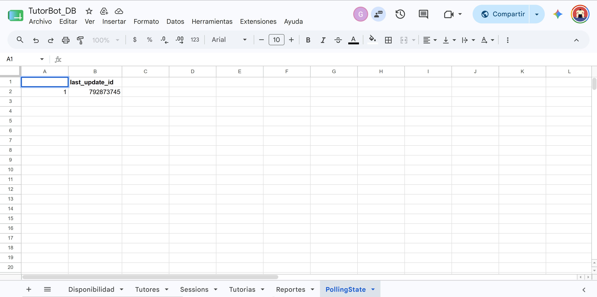
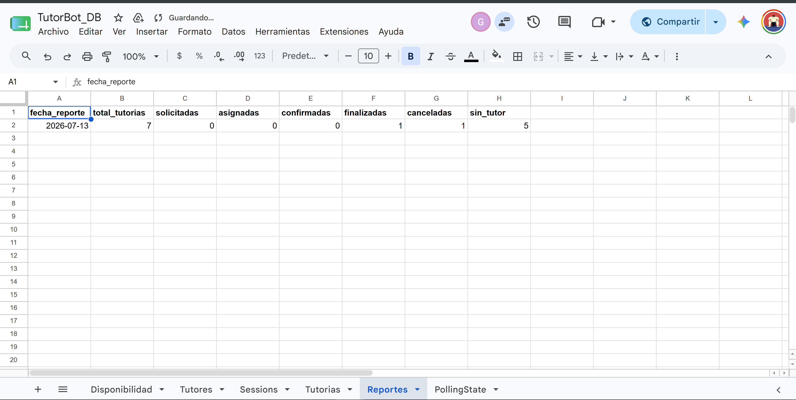
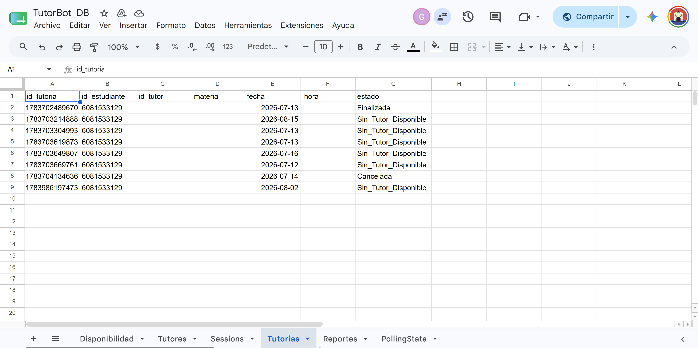
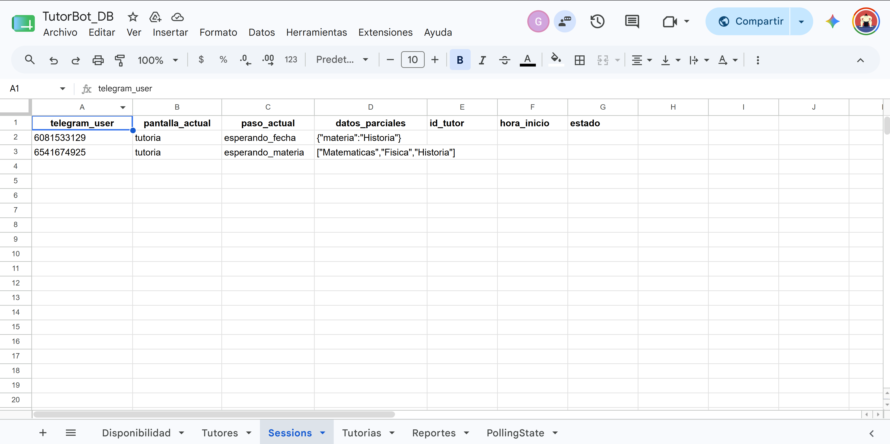
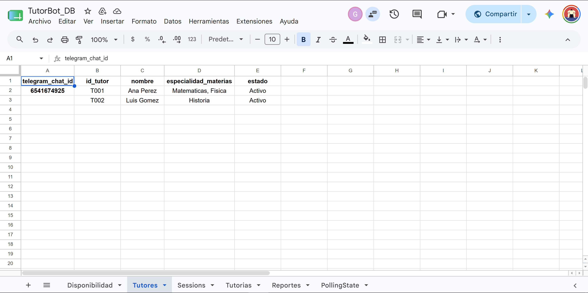
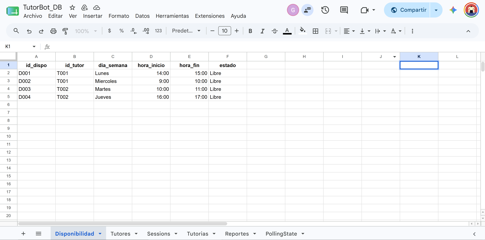

# TutorBot — Sistema de Asesorías Académicas

Bot de Telegram construido en n8n que conecta estudiantes con tutores disponibles, gestionando materias, horarios, confirmaciones y registro de tutorías en Google Sheets.

## Introducción

En el entorno educativo actual, la coordinación de asesorías académicas suele ser un proceso caótico y manual. Los estudiantes dependen de correos electrónicos o mensajes informales para encontrar un tutor, mientras que los tutores no tienen una agenda centralizada para gestionar su disponibilidad. Esto genera cruces de horarios, desatención de materias críticas y falta de trazabilidad.

**TutorBot** es una solución automatizada desarrollada en n8n que conecta a estudiantes con tutores mediante un motor de asignación inteligente, gestionando el proceso desde la solicitud inicial hasta la finalización de la asesoría.

## Objetivos

- Desarrollar un sistema automatizado para la gestión de tutorías académicas que integre Telegram, Google Sheets y lógica avanzada de asignación.
- Implementar un motor de búsqueda que asocie automáticamente materia, tutor y horario libre.
- Diseñar una interfaz conversacional en Telegram para la autogestión del estudiante (solicitar, consultar, cancelar).
- Automatizar el control de estados de la tutoría (Solicitada, Asignada, Confirmada, Finalizada).
- Generar reportes automáticos de actividad para la coordinación académica.
- Validar disponibilidad en tiempo real para evitar cruces de agenda o doble reserva.

## Resultado esperado

1. **Reducción del 90%** en el tiempo de asignación de tutorías.
2. **Trazabilidad total**: historial completo de quién solicitó, quién atendió y cuándo terminó.
3. **Escalabilidad**: capacidad para gestionar cientos de tutores y estudiantes simultáneamente.
4. **Experiencia de usuario**: interfaz amigable que guía al estudiante paso a paso sin necesidad de manuales.

## Integrantes

- **Julian Pinto Uribe** — Entrada y captura de datos (menú, sesión, selección de materia y fecha).
- **Heiling Leon** — Motor de asignación y confirmación (matching, registro, notificaciones), integración final del workflow, recepción de mensajes, reportes y recordatorios automáticos.

## Arquitectura general

El bot funciona como una máquina de estados: cada usuario tiene una fila en la hoja `SESSIONS` que indica en qué paso de la conversación está (`paso_actual`). Un nodo `Switch` (**Router Paso**) dirige el mensaje entrante al bloque de lógica correspondiente según ese paso.

**Nota sobre la recepción de mensajes:** en el diseño inicial se planteó usar un `Telegram Trigger` (webhook). En la implementación final se usa en su lugar un **polling programado cada 5 segundos**, porque el entorno de desarrollo corre en Docker local sin URL pública expuesta (evitando depender de ngrok u otro túnel).

Un detalle importante descubierto durante la integración: la memoria interna de n8n (`$getWorkflowStaticData`) **no es confiable para guardar el offset de Telegram** bajo triggers de alta frecuencia (advertencia documentada oficialmente por n8n). Por eso el offset se guarda de forma durable en una hoja de cálculo dedicada (`PollingState`) en vez de en memoria.

El flujo real de entrada es:

```
Trigger Polling (cada 5s)
   -> Config Bot Token
   -> Leer Offset                  (lee last_update_id desde la hoja PollingState)
   -> Preparar Peticion Updates    (arma la URL de getUpdates con ese offset)
   -> Obtener Updates Telegram     (HTTP Request a api.telegram.org/getUpdates)
   -> Procesar Updates             (toma UN SOLO update por ciclo, para no mezclar mensajes)
   -> Avanzar Offset?  --true--> Guardar Offset (persiste el nuevo offset en PollingState)
                                      -> Hay Mensaje Nuevo?  --true--> Preparar Datos Entrada
                                                              --false-> (fin del ciclo, era un update sin mensaje)
                       --false-> (fin del ciclo, no habia nada nuevo)

Preparar Datos Entrada
   -> Leer Sesiones
   -> Buscar Mi Sesion   (detecta comandos globales: /start, /consultar, /cancelar)
   -> Existe Sesion?     (ambas ramas, true y false, continuan igual hacia Router Paso;
                          la sesion se crea/actualiza mas adelante con appendOrUpdate,
                          sin necesidad de un paso de creacion separado)
   -> Router Paso
        - menu                    -> menu de materias
        - esperando_materia        -> validacion de materia
        - esperando_fecha          -> validacion de fecha + busqueda de tutor
        - esperando_confirmacion   -> confirmacion y registro
        - consultando              -> consulta de tutorias propias
        - cancelando               -> cancelacion de tutoria activa
```

> Si en el futuro se despliega en un servidor con dominio o IP pública, se recomienda migrar a `Telegram Trigger` nativo (webhook), lo que elimina la necesidad de los nodos `Config Bot Token`, `Leer Offset`, `Preparar Peticion Updates`, `Obtener Updates Telegram`, `Procesar Updates`, `Avanzar Offset?`, `Guardar Offset`, `Hay Mensaje Nuevo?` y la hoja `PollingState`.


## Base de datos (Google Sheets)

Archivo compartido: `TutorBot_DB` — mismo `documentId` usado en todos los nodos de Sheets del proyecto.

| Hoja | Responsable original | Descripción |
|---|---|---|
| `TUTORES` | Julian Pinto Uribe | Catálogo de tutores, materias que dan, estado |
| `SESSIONS` | Julian Pinto Uribe | Estado de la conversación por usuario |
| `DISPONIBILIDAD` | Heiling Leon | Horarios de cada tutor y si están libres/ocupados |
| `TUTORIAS` | Heiling Leon | Registro de tutorías asignadas |
| `Reportes` | Heiling Leon | Reporte diario automático de actividad (agregado en la integración final) |
| `PollingState` | Heiling Leon | Guarda el offset de Telegram de forma durable (agregado por la implementación de polling; no forma parte del modelo de datos original del PDF) |

> **Nota de formato:** las columnas numéricas de `Reportes` (`total_tutorias`, `solicitadas`, `asignadas`, `confirmadas`, `finalizadas`, `canceladas`, `sin_tutor`) deben tener formato **Número** en Google Sheets. Si Sheets las autoformatea como Fecha/Hora, un valor como `1` se muestra como `31/dic/1899` y `0` como `0:00` — el dato guardado es correcto, es solo un problema de formato de celda (`Formato → Número → Número`).

### `TUTORES`

| Columna | Descripción |
|---|---|
| `id_tutor` | Identificador único del tutor |
| `nombre` | Nombre del tutor |
| `especialidad_materias` | Materias que dicta (texto, se busca por coincidencia de subcadena) |
| `estado` | `Activo` / `Inactivo` |
| `telegram_chat_id` | **Columna necesaria** para poder notificarle al tutor por Telegram cuando se le asigna una tutoría |

### `SESSIONS`

| Columna | Descripción |
|---|---|
| `telegram_user` | Chat ID de Telegram del estudiante (identificador de sesión). **Debe formatearse como texto plano en la hoja**, no como número — Google Sheets lo autoconvierte y rompe la coincidencia de filas en las operaciones `appendOrUpdate`. |
| `pantalla_actual` | Pantalla mostrada al usuario |
| `paso_actual` | Paso del wizard: `menu`, `esperando_materia`, `esperando_fecha`, `esperando_confirmacion`, `consultando`, `cancelando` |
| `datos_parciales` | JSON serializado con los datos capturados hasta el momento (materia, fecha, tutor propuesto, etc.) |

> Todas las escrituras sobre esta hoja usan la operación `appendOrUpdate` (no `update`), para garantizar que la fila se cree si el usuario es nuevo y se actualice si ya existe — con `update` puro, un estudiante sin fila previa nunca queda registrado.

### `DISPONIBILIDAD`

| Columna | Descripción |
|---|---|
| `id_dispo` | Identificador único del horario |
| `id_tutor` | Referencia al tutor (coincide con `TUTORES.id_tutor`) |
| `dia_semana` | `Lunes`, `Martes`, `Miercoles`, `Jueves`, `Viernes`, `Sabado`, `Domingo` (sin tilde) |
| `hora_inicio` / `hora_fin` | Formato `HH:MM`, 24 horas |
| `estado` | `Libre` u `Ocupado` |

### `TUTORIAS`

| Columna | Descripción |
|---|---|
| `id_tutoria` | Identificador único (generado con `$now.toMillis()`) |
| `id_estudiante` | `telegram_user` del estudiante (mismo cuidado de formato de texto que en `SESSIONS`) |
| `id_tutor` | Tutor asignado |
| `materia` / `fecha` / `hora` | Datos de la tutoría |
| `estado` | Ver ciclo de estados abajo |

### `PollingState`

| Columna | Descripción |
|---|---|
| `id` | Fijo en `1` (una sola fila de control) |
| `last_update_id` | Último `update_id` de Telegram ya procesado. Arranca en `0`. |

## Ciclo de estados de una tutoría (confirmado en la integración final)

| Estado | ¿Cuándo se genera? | Nodo responsable |
|---|---|---|
| `Solicitada` | Al validar la fecha y antes de buscar tutor | `Registrar Solicitud (Solicitada)` |
| `Asignada` | Cuando el motor de matching encuentra tutor y horario libre, y se envía la propuesta al estudiante | `Actualizar Tutoria (Asignada)` |
| `Sin_Tutor_Disponible` | Cuando no hay ningún tutor con esa materia y horario libre ese día | `Actualizar Tutoria (Sin Tutor)` |
| `Confirmada` | Cuando el estudiante confirma la propuesta (responde "sí") | `Actualizar Tutoria (Confirmada)` |
| `Cancelada` | Cuando el estudiante rechaza la propuesta ("no"), o cuando cancela una tutoría ya confirmada con `/cancelar` | `Actualizar Tutoria (Rechazada)` / `Cancelar Tutoria (Sheet)` |
| `Finalizada` | Automáticamente, cuando una tutoría `Confirmada` tiene fecha anterior a hoy (job diario 20:00) | `Marcar Finalizadas` |

> Nota de nomenclatura: el nodo que registra el rechazo del estudiante se llama `Actualizar Tutoria (Rechazada)` pero internamente guarda el estado como `Cancelada` (no existe un estado `Rechazada` separado en la hoja). Se deja documentado para evitar confusión al leer el JSON.

## Flujo "Solicitar Tutoría" (Julian Pinto Uribe + Heiling Leon)

1. **Materia:** el bot lista las materias disponibles (`Leer Tutores (menu)` -> `Listar Materias Unicas` -> `Enviar Menu Materias`). Se guarda la elección en `SESSIONS` (`Guardar Materia Elegida`, validada por `Materia Valida?`).
2. **Horarios disponibles:** antes de pedir la fecha, el bot muestra los tutores activos de esa materia junto con sus horarios `Libre` en `DISPONIBILIDAD` (`Leer Tutores (Horarios)` -> `Leer Disponibilidad (Horarios)` -> `Formatear Horarios Disponibles` -> `Enviar Horarios Disponibles`), agrupados por tutor (ej: `Ana Perez: Lunes 14:00-15:00`). Esto le da al estudiante contexto real antes de escribir una fecha, en vez de que la adivine a ciegas.
3. **Fecha:** el estudiante escribe la fecha en formato `YYYY-MM-DD`. El nodo `Validar Fecha` comprueba que sea una fecha calendario real y que no sea anterior a hoy.
4. **Búsqueda:** `Preparar Datos Busqueda` calcula el día de la semana a partir de la fecha; `Match Tutor Disponible` cruza tutores activos de esa materia con disponibilidad libre ese día.
5. **Propuesta y confirmación:** si hay match (`Tutor Encontrado?`), se envía la propuesta (`Enviar Propuesta`) y se espera confirmación (`esperando_confirmacion`, guardada por `Guardar Sesion Propuesta`). Si el estudiante confirma, se marca `Confirmada`, se ocupa el horario (`Actualizar Disponibilidad Ocupado`) y se notifica a ambas partes (`Confirmar Estudiante`, `Notificar Tutor`).
6. **Sin match:** si no hay tutor disponible para esa fecha puntual, se marca `Sin_Tutor_Disponible`, se avisa al estudiante (`Sin Tutores Disponibles`) y la sesión **conserva la materia ya elegida**, quedando lista para que el estudiante escriba directamente otra fecha sin tener que repetir la selección de materia (`Reset Sesion (Sin Tutor)`).

Un estudiante puede solicitar más de una tutoría: escribir `/start` en cualquier momento (incluso con una tutoría ya confirmada) reinicia el wizard desde el menú de materias.

## Flujo "Consultar mis tutorías" (integrado en la versión final)

El estudiante escribe `/consultar` o "mis tutorias" en cualquier momento (comando global reconocido por `Buscar Mi Sesion`, que interrumpe el paso actual). El flujo lee sus tutorías (`Leer Tutorias (Consultar)`), las formatea en un mensaje legible (`Formatear Mis Tutorias`) y las envía (`Enviar Mis Tutorias`), reseteando la sesión al menú principal.

## Flujo "Cancelar tutoría" (integrado en la versión final)

El estudiante escribe `/cancelar`. El sistema busca si tiene una tutoría activa (`Buscar Tutoria Activa` -> `Hay Tutoria Activa?`):
- **Sí tiene:** se marca como `Cancelada` (`Cancelar Tutoria (Sheet)`), se libera el horario en `DISPONIBILIDAD` (`Liberar Disponibilidad (Cancelar)`) y se confirma al estudiante (`Confirmar Cancelacion`).
- **No tiene:** se le informa que no hay ninguna tutoría activa para cancelar (`Sin Tutoria Para Cancelar`).

## Automatizaciones programadas (agregadas en la integración final)

| Trigger | Horario | Función |
|---|---|---|
| `Trigger Diario (20:00)` | 20:00 diario | Marca como `Finalizada` toda tutoría `Confirmada` con fecha ya pasada (`Filtrar Tutorias A Finalizar` -> `Marcar Finalizadas`), y genera el reporte de actividad del día (`Generar Reporte de Actividad` -> `Guardar Reporte (hoja Reportes)`) con el conteo de tutorías por estado. `Guardar Reporte` usa `appendOrUpdate` sobre `fecha_reporte`, así que si el job corre más de una vez el mismo día (por ejemplo al probarlo manualmente), actualiza la fila existente en vez de duplicarla. |
| `Trigger Recordatorios` | 11:00 diario | Busca tutorías `Confirmada` para el día siguiente y envía recordatorio tanto al estudiante como al tutor (`Preparar Recordatorios` -> `Recordar Estudiante` / `Recordar Tutor`). |

## Lógica clave — código de matching (versión final integrada)

```javascript
// Recuperamos los datos de la solicitud (materia, fecha, dia_semana, id_tutoria)
const sesion = { ...$('Preparar Datos Busqueda').first().json, id_tutoria: $('Registrar Solicitud (Solicitada)').first().json.id_tutoria };

// Filtramos tutores activos que dicten la materia solicitada
const tutores = $('Leer Tutores').all().map(i => i.json)
  .filter(t => t.estado === 'Activo' && (t.especialidad_materias || '').includes(sesion.materia));

const disponibilidad = $input.all().map(i => i.json);
const tutorIds = tutores.map(t => t.id_tutor);

// Buscamos un slot libre de alguno de esos tutores, ese dia
const libre = disponibilidad.find(d =>
  tutorIds.includes(d.id_tutor) &&
  d.dia_semana === sesion.dia_semana &&
  d.estado === 'Libre'
);

const tutor = libre ? tutores.find(t => t.id_tutor === libre.id_tutor) : null;

return [{
  json: {
    ...sesion,
    encontrado: !!libre,
    id_dispo: libre ? libre.id_dispo : null,
    hora_inicio: libre ? libre.hora_inicio : null,
    tutor_nombre: tutor ? tutor.nombre : null,
    id_tutor: tutor ? tutor.id_tutor : null,
    telegram_chat_id_tutor: tutor ? tutor.telegram_chat_id : null
  }
}];
```

## Cómo se probó (desarrollo aislado, previo a la integración)

Antes de integrarse, el motor de asignación (Parte B) se desarrolló y probó de forma independiente usando un `Manual Trigger` + nodo `Set` que simulaba `materia`/`fecha` entregadas por Parte A. Casos cubiertos:

- Match exitoso (tutor y horario libre encontrados).
- Sin match (materia/día sin disponibilidad).
- Confirmación aceptada (registro completo en `TUTORIAS` + notificaciones).
- Confirmación rechazada (cancelación + reseteo de sesión).
- Match con distintos tutores/horarios.

Tras la integración, estos nodos de simulación fueron eliminados y reemplazados por la conexión real desde `Router Paso` (ver diagrama de arquitectura).

**Pruebas de integración end-to-end** (bot real vía Telegram, contra Google Sheets real): se validó el flujo completo `/start` → selección de materia → fecha válida → propuesta de tutor → confirmación → notificación a estudiante y tutor, confirmando además que el horario queda correctamente marcado `Ocupado` en `DISPONIBILIDAD` tras la confirmación.

## Instalación y ejecución

### 1. Requisitos previos
- Docker y Docker Compose.
- Cuenta de Google con acceso al Google Sheets `TutorBot_DB`.
- Bot de Telegram creado con [@BotFather](https://t.me/BotFather).

### 2. Clonar el repositorio
```bash
git clone https://github.com/<usuario>/Proyecto_TutorBot_ApellidoNombre.git
cd Proyecto_TutorBot_ApellidoNombre
```

### 3. Importar el workflow
`Workflows` -> `Import from File` -> seleccionar el `.json` del repositorio.

### 4. Configurar credenciales en n8n
El JSON no incluye secretos (solo referencias `id`/`name`). Crear manualmente en `Credentials`:

| Credencial | Tipo | Usada por |
|---|---|---|
| `Telegram account 2` | Telegram API | Todos los nodos de envío de mensajes |
| `Google Sheets account` | Google Sheets OAuth2 | Todos los nodos de lectura/escritura sobre `TutorBot_DB` |

### 5. Configurar el token del bot para el polling
Abrir el nodo **`Config Bot Token`** y pegar el token real entregado por BotFather en el campo `bot_token`.

### 6. Preparar la hoja `PollingState`
Crear una hoja llamada exactamente `PollingState` con columnas `id`, `last_update_id`, y una fila de datos: `id = 1`, `last_update_id = 0`.

### 7. Activar el workflow
Botón **Publish** para que el polling y los triggers programados comiencen a correr.

### 8. Probar
Enviar `/start` al bot desde Telegram y seguir el menú. Probar también `/consultar` y `/cancelar`.

## Capturas del flujo
 

## Limitaciones conocidas

- **Recepción por polling:** el bot consulta Telegram cada 5 segundos en vez de usar un webhook en tiempo real (`Telegram Trigger`). Es la opción elegida por no exponer una URL pública en el entorno de desarrollo local. El offset se guarda en la hoja `PollingState` (no en memoria de n8n) porque `$getWorkflowStaticData` no es confiable con triggers de alta frecuencia.
- **Reserva del cupo de disponibilidad:** el horario se marca como `Ocupado` recién al momento de la **confirmación** del estudiante, no al momento de la propuesta inicial. Si dos estudiantes solicitan el mismo tutor y horario de forma simultánea antes de que el primero confirme, ambos podrían recibir la misma propuesta. Punto de mejora para una siguiente iteración (por ejemplo, reservar el slot desde el momento en que se propone).
- **Coincidencia de materia por texto:** la búsqueda de tutor por materia usa coincidencia de subcadena sobre `especialidad_materias`, por lo que nombres de materias muy similares podrían generar falsos positivos ocasionales.
- **Sin bloqueo de solicitudes duplicadas:** el bot no impide que un estudiante solicite varias tutorías de la misma materia; cada solicitud se procesa de forma independiente.
- **Conteo de tutores en el paso de horarios:** el nodo `Leer Tutores (Horarios)` lee todas las filas de `TUTORES` sin filtrar filas vacías; si la hoja tiene filas en blanco por debajo de los datos, `n8n` las cuenta igual (no afecta el resultado mostrado al estudiante, pero puede verse un número de "items" mayor al esperado en el panel de ejecución de n8n).
- **Nomenclatura del nodo `Actualizar Tutoria (Rechazada)`:** por consistencia con el resto del workflow, guarda el estado como `Cancelada` en vez de un estado `Rechazada` separado; documentado arriba para evitar confusión.

## Link del Google sheets

https://docs.google.com/spreadsheets/d/1pmz3UwQSOmPZssZOFpx3-R3m7_XXLMIQha1fzln2Nww/edit?usp=sharing

## Hoja PolingState


## Hoja Reportes


## Hoja Tutorias


## Hoja Sessions


## Hoja Tutores


## Hoja Disponibilidad
